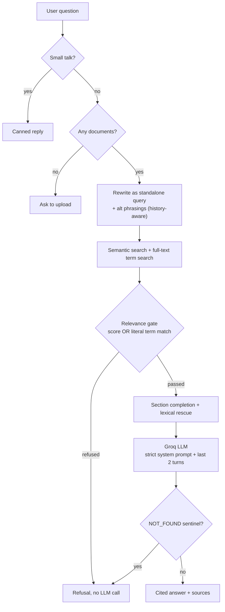

# 📑 DocuLens

**Answers from your documents, and nothing else.**

<p>


</p>

DocuLens is a document question-answering app. Users upload their own files and ask questions; every answer is generated **only** from those files and shows the passage it came from. It is deliberately *not* a general chatbot: ask it about the capital of France and it will tell you it can't find that in your documents.

*(Evolved from MemoraAI. The long-term "companion" memory was removed because remembering things outside the uploaded files works against the goal.)*

---

## Contents

- [Tech stack](#tech-stack)
- [How answers are kept inside the documents](#how-answers-are-kept-inside-the-documents)
- [How documents are chunked](#how-documents-are-chunked-semantic-chunking)
- [Finding a specific term (lexical rescue)](#finding-a-specific-term-lexical-rescue)
- [Conversation memory](#conversation-memory)
- [Features](#features)
- [Setup](#setup)
- [Design decisions](#design-decisions--why-its-built-this-way)
- [Challenges along the way](#challenges-along-the-way)
- [Project structure](#project-structure)
- [Troubleshooting](#troubleshooting-i-couldnt-find-this-in-your-documents)
- [Tuning](#tuning-min_relevance_score)
- [Limits worth knowing](#limits-worth-knowing)

---

## Tech stack

| Layer | Choice | Role |
|---|---|---|
| UI | **Streamlit** | Chat interface, document manager, auth screens, all in Python |
| LLM inference | **Groq** (`llama-3.3-70b-versatile`) | Answer generation and query rewriting, temperature `0` |
| Embeddings | **Google Gemini** (`gemini-embedding-001`) | Document and query vectors, 768-dim |
| Vector store | **Qdrant Cloud** | Per-user semantic search + full-text lexical search (hybrid retrieval) |
| Metadata store | **MongoDB Atlas** | Users, conversations, messages, document records |
| Auth | **bcrypt** | Password hashing |
| Document parsing | **pypdf**, **python-docx** | Text + structure extraction from PDF / DOCX |
| Testing | **pytest** (offline, no network) | Chunking, gate, retrieval, grounding, prompts |

All five external services are free-tier friendly: [Groq](https://console.groq.com), [Google AI Studio](https://aistudio.google.com), [MongoDB Atlas](https://www.mongodb.com/atlas), [Qdrant Cloud](https://cloud.qdrant.io).

---

## How answers are kept inside the documents

| Layer | What it does | Calls the LLM? |
|---|---|---|
| 1. Small-talk handler | Greetings / thanks / "what can you do" get a canned reply | No |
| 2. No-documents check | If nothing is uploaded, asks the user to upload | No |
| 3. **Relevance gate** | The best match for the user's own question must reach `MIN_RELEVANCE_SCORE`. Up to 0.10 below it, it still passes if the question's key terms appear in the retrieved passages. Below that, a *literal* match on a distinctive term (full-text search, not embedding score) still passes. Anything else is refused | **No** |
| 4. **Strict system prompt** | The model may use only the numbered excerpts, must cite `[n]`, ignores instructions found inside documents, and ignores requests to use outside knowledge | Yes (temperature 0) |
| 5. Sentinel filter | If the model replies `NOT_FOUND_IN_DOCUMENTS`, the user sees the standard refusal and no sources | - |

Layer 3 keeps clearly off-topic questions away from the model. It is deliberately lenient, because raw similarity scores vary with chunk size and embedding model, and a bad lexical match at worst costs one wasted LLM call that correctly says "not found" — never a hallucinated one. Layers 4-5 are the real backstop: anything that gets through is still answered only from the retrieved passages, or refused.



Follow-up questions ("and what about its cost?") are rewritten into a standalone search query using recent chat history, and each question also gets one or two alternative phrasings. These queries are used **only for retrieval**; they are never shown as answers. The off-topic gate looks only at the user's own question, so a rephrasing can never talk its way past it.

The answering model also sees the last couple of turns, but only so it can resolve what a bare follow-up like "explain it" or "why" is actually asking about - the system prompt explicitly forbids treating anything said in an earlier turn as a fact or a citable source (`rag/prompts.py`, rule 11). Every claim and citation in the answer must still come from the `<context>` block built fresh for the current turn, not from an earlier answer.

---

## How documents are chunked (semantic chunking)

1. **Structure first.** DOCX headings (real Heading styles, plus short all-bold lines), Markdown headings, and, for PDF/TXT, numbered or ALL-CAPS headings define sections. Each chunk keeps its heading path, e.g. `Phase 1 > PaddleOCR-VL 1.6`.
2. **One topic, one chunk.** A section that fits in `CHUNK_MAX_CHARS` stays whole, so a topic is never cut in half.
3. **Meaning-based splits.** A longer section is split where the meaning shifts: each sentence is embedded and the sharpest drops in similarity between neighbouring sentences become boundaries.
4. **No stray fragments.** Tiny neighbouring sections (under `CHUNK_MIN_CHARS`) are merged.
5. **Context in the embedding.** Each chunk is embedded together with the document title and section path, so a passage that only says "accuracy: 94%" still knows which model it belongs to.
6. **Document overview chunk.** Every document also gets one extra chunk listing all of its headings plus its opening text. Broad questions such as "what models were discussed?" or "what is this document about?" don't resemble any single section, so this chunk gives them something to match.
7. **Broad questions.** After the relevance gate, every passage within `RELEVANCE_MARGIN` of the best score is sent to the model (up to `MAX_CONTEXT_CHUNKS`), and the answer prompt tells the model to cover every excerpt for "list / compare / all" questions.

If sentence embedding fails (e.g. a rate limit), chunking falls back to size-based packing on sentence boundaries, so uploads still succeed.

> **Re-upload after upgrading.** Documents indexed by an older chunker keep working, but lack section information and the overview chunk. Remove and re-upload them. `python -m scripts.diagnose --email you@example.com --chunks` lists which documents need it, including ones that were indexed correctly but are missing content for other reasons (see [Challenges](#challenges-along-the-way) below).

---

## Finding a specific term (lexical rescue)

Retrieval is otherwise pure dense/embedding search, which is exactly weakest on a single distinctive term - a model name, a version number, a bit of jargon, or a short direct question like "what is X". A chunk can be a perfect literal match for the term and still rank low enough on cosine similarity to fall outside `RELEVANCE_MARGIN`, or even below the off-topic gate's own threshold, and never reach the model.

`rag/retriever.py` runs one filtered vector search per question (`database.vector_store.search_terms`, backed by a full-text index on the chunk body) restricted to chunks that literally contain a distinctive term of the question. It's used in two places:

- **The gate** (`rag/gate.py`): a literal term match passes the gate regardless of how low the embedding score is, not just within the existing borderline band. A short, direct question carries little embedding signal on its own, and the gate's ordinary borderline rescue only looks at the top few *semantic* hits' text - a section that didn't rank there is otherwise invisible to it even when the term is genuinely in the document.
- **Widening** (`_lexical_rescue`): once the gate has passed, the same matched chunks are folded into the normal ranked candidate pool and, if still excluded by `RELEVANCE_MARGIN`, force-included up to `LEXICAL_RESCUE_EXTRA_CHUNKS` extra chunks.

Matches are still ranked by embedding similarity within that filtered set - it narrows which chunks are eligible, not a keyword dump. This is safe to be lenient about: layers 4-5 (the strict system prompt and the `NOT_FOUND` sentinel) are the real backstop, so the worst case of a bad lexical match is one extra LLM call that correctly says it can't find the answer, never a hallucinated one.

> **After upgrading to this version, restart the app process once.** `database.vector_store.search_terms` needs a full-text index on the chunk body that `ensure_collection()` creates on startup; a long-running process that was already up when you deployed this change won't have it yet, and `search_terms` will silently return no results (it fails safe, so this looks exactly like "still refused" rather than an error). A restart re-runs `ensure_collection()` and backfills the index on your existing collection - no re-upload needed for this specific fix.

---

## Conversation memory

DocuLens keeps just enough memory to make follow-ups work, and no more:

- **Retrieval** (`rag/query_planner.py`): the last few turns are used to rewrite a vague follow-up ("and its cost?") into a standalone search query, plus one or two alternative phrasings. Used only to decide *what to search for*.
- **Answer generation** (`rag/prompts.py`, `chat/chat_engine.py`): the last couple of turns are included as real prior messages so the model can resolve pronouns and bare follow-ups ("explain it", "why", "compare it to X"). A dedicated system-prompt rule forbids treating anything said in an earlier turn as a fact or citable source - every claim and citation still has to come from the freshly retrieved `<context>` for the current turn.
- **Off-topic gate**: sees only the user's own current question (rewritten to be standalone), never the full history - a rephrasing can't talk its way past it.
- **Nothing else persists**: no long-term profile, no memory outside the current conversation and the uploaded documents themselves. That's intentional - see [Design decisions](#design-decisions--why-its-built-this-way).

---

## Features

- Register / sign in (bcrypt), per-user isolation in both MongoDB and Qdrant
- Upload PDF, DOCX, TXT and Markdown; duplicates detected by content hash
- Documents page to see and remove files (removal also deletes their vectors)
- Optional "Search only in" filter to restrict a question to specific documents
- Streaming answers with highlighted citation chips and a Sources panel (file, page, excerpt, match score)
- Saved conversation history, with follow-up questions resolved using recent context
- Light / dark mode, switchable at runtime, no restart needed
- A **Search details** panel on every answer: queries tried, gate decision, ranked passages with scores

---

## Setup

```bash
pip install -r requirements.txt
cp .env.example .env      # fill in the keys
streamlit run app.py
```

Free-tier services used: [Groq](https://console.groq.com) (LLM), [Google AI Studio](https://aistudio.google.com) (embeddings), [MongoDB Atlas](https://www.mongodb.com/atlas), [Qdrant Cloud](https://cloud.qdrant.io).

> **`EMBEDDING_MODEL` matters.** Use `gemini-embedding-001` (the default). `gemini-embedding-2` / `gemini-embedding-2-preview` have a known SDK bug where a batch embedding call silently returns only one vector back, no matter how many were sent - see [Challenges](#challenges-along-the-way). The code now fails loudly if this ever happens again, but the safest fix is simply not using an affected model.

Run the offline tests: `python -m pytest tests` (62 tests, no network or API keys needed).

---

## Design decisions — why it's built this way

**Section-aware chunking over fixed-size chunking.** Splitting every N characters cuts topics in half and buries a specific fact in a chunk about something else. Chunking by detected document structure (headings) keeps one topic per chunk, with meaning-based splitting only when a section is too long to embed well as one piece, and merging only when a section is too short to be useful alone. Chunk size stays in a deliberate optimal band (`CHUNK_MIN_CHARS`-`CHUNK_MAX_CHARS`) rather than one fixed number.

**Hybrid retrieval, not pure dense search.** Embedding similarity is weakest on exactly the things people ask most - a model name, a version number, a specific figure. A full-text literal-match search runs alongside the semantic search and can independently pass the gate and rescue chunks that rank low, so retrieval doesn't depend on the embedding model "getting" short, specific questions.

**A lenient gate, a strict prompt.** The relevance gate's job is only to keep obviously off-topic questions from wasting an LLM call, not to be the source of truth on grounding. It's tuned to let borderline cases through, because the real enforcement is the system prompt (must cite `[n]`, must answer only from `<context>`) and the `NOT_FOUND` sentinel filter afterward. A false pass through the gate costs one extra LLM call; a false refusal costs the user a real answer they were owed.

**History for disambiguation, never for facts.** It would be simpler to just paste the whole conversation into the answer prompt and let the model use it as it likes. That was deliberately rejected: it would let a wrong or stale detail from an earlier turn quietly resurface in a new answer, and it would break the citation numbering (which is tied to the current turn's retrieved `<context>`, not to anything said earlier). History is included only so the model knows *what* is being asked, never *what the answer is*.

**No long-term memory beyond the conversation.** DocuLens evolved from MemoraAI, which kept a persistent "companion" memory across sessions. That was removed: an app whose entire premise is "answers only come from what you uploaded" shouldn't also be quietly drawing on things a user said in an unrelated past conversation.

**Diagnostics as first-class, not an afterthought.** `scripts/diagnose.py` and `scripts/check_chunking.py` exist because "it says it can't find this" is otherwise a black box. Every answer also carries a Search details panel so the failure mode (gate refusal vs. model refusal vs. bad retrieval) is visible without reading logs.

---

## Challenges along the way

A few issues came up during development that were subtle enough to be worth recording, in case they resurface:

**1. The gate could only see what semantic search already found.** Early on, the keyword-based "borderline rescue" in the relevance gate only re-checked the text of the chunks that semantic search *already* returned in its top few results. A short, direct question ("what is paddleocr") carries very little embedding signal, so the chunk that actually answered it sometimes never made the semantic top-k at all - making it invisible to the gate's own keyword check, even though the term was genuinely in the document. Fixed by giving the gate its own independent full-text search over the whole document, not just a second look at whatever semantic search happened to surface.

**2. A stale document looked identical to a live bug.** A document reprocessed under different pipeline versions during development ended up with only its auto-generated overview chunk stored - the real content chunks were missing. Nothing about this looked wrong from the UI: the document showed as "ready" and the overview chunk alone was enough to pass the relevance gate, so it looked exactly like a retrieval bug rather than stale data. Standalone diagnostic scripts (`check_chunking.py`, `diagnose.py --chunks`) that bypass the running app and Qdrant entirely were what made it possible to tell the two apart.

**3. A silent embedding API bug caused silent data loss.** The root cause behind #2, once fully traced: `EMBEDDING_MODEL=gemini-embedding-2` has a documented SDK issue where a single `embed_content()` call with a *list* of texts returns exactly one embedding back, regardless of how many were sent, with no error raised. The code paired the returned vectors with chunks positionally (`zip(chunks, vectors)`), so the one vector that came back landed on `chunks[0]` - which is always the overview chunk, since it's prepended first - and every other chunk was silently dropped. The document still ended up marked `ready`, because nothing ever raised an exception. Fixed two ways: (a) wrap each text explicitly per the SDK's documented workaround, and (b) treat a vector-count mismatch as a hard, loud failure at two separate points in the pipeline (`rag/embeddings.py` and `rag/document_processor.py`), so this class of bug can never again fail silently - it now rejects the upload outright instead of storing a corrupted document.

**4. Retrieval used history, but the model answering the question didn't.** Query rewriting already used chat history to turn "explain it" into a proper search query, so retrieval quietly found the right passages. But the prompt that actually generates the answer never included that history - the model was shown only the literal word "it", with no way to know what it referred to, and correctly (if unhelpfully) said it couldn't find an answer. Fixed by including recent turns in the answer prompt too, with an explicit rule scoping them to disambiguation only, so they can't become an unwanted second source of facts alongside the real, freshly-retrieved context.

**5. Streamlit's native theming can't switch at runtime.** `.streamlit/config.toml`'s `[theme]` block only takes effect on a full server restart, which rules it out for a user-facing light/dark toggle. The fix was making every color in the CSS a variable and re-rendering the stylesheet with a different palette based on `st.session_state.dark_mode` on every rerun - a plain Python-level toggle rather than anything CSS-media-query-based, so it reflects an explicit user choice rather than their OS setting.

---

## Project structure

```
app.py                     Streamlit entry point + routing + dark-mode wiring
config/settings.py         Settings (.env), app name
auth/                      Register / login, bcrypt helpers
database/
  mongo_client.py          Users, conversations, messages, document metadata
  vector_store.py          Qdrant: upsert / user-scoped semantic + lexical search / delete
rag/
  structure.py             Headings -> sections with heading paths
  semantic_chunker.py      Section-aware, meaning-based chunking
  chunking.py              Size-based splitter (used for oversized sentences)
  document_processor.py    Validate -> extract -> structure -> chunk -> embed -> index
  embeddings.py            Gemini embeddings (document / query / similarity task types)
  retriever.py             Multi-query search, relevance gate, section + lexical widening
  query_planner.py         Search-query rewriting / expansion (retrieval only)
  citations.py             Recognises [1], 【1】, [1, 2] citation styles
  guardrails.py            Refusal messages, small talk, sentinel stream filter
  prompts.py               Strict answer prompt, history scoped to disambiguation only
chat/chat_engine.py        Orchestrates layers 1-5
ui/                        styles (light/dark), login, sidebar, chat page, documents page
scripts/
  diagnose.py              Per-document chunk counts, chunker version, gate settings
  check_chunking.py        Runs chunking + embedding against a real file, bypassing the app
tests/                     Offline tests: guardrails, prompts, chunking, structure, gate, citations
```

---

## Troubleshooting: "I couldn't find this in your documents"

Every answer has a **Search details** panel (turn it off with `SHOW_SEARCH_DETAILS=false`). It shows the queries searched, the ranked passages with scores, and *why* a refusal happened:

- **Refused before calling the model**: no passage matched closely enough, and no literal term match was found either. Look at the scores. If the right section scores just under the minimum, lower `MIN_RELEVANCE_SCORE`. If the right section isn't listed at all, the document probably needs re-uploading.
- **Passages were sent, but the model found no answer**: retrieval worked, but the passages don't contain the answer. Raise `RELEVANCE_MARGIN` and `MAX_CONTEXT_CHUNKS` so more sections are sent.

To inspect from the command line:

```bash
python -m scripts.diagnose --email you@example.com --chunks              # how each document was split
python -m scripts.diagnose --email you@example.com "your question here"  # queries, gate decision, scores
python -m scripts.check_chunking path\to\file.docx                       # re-run chunking + embedding on a real file, bypassing the app entirely
```

`check_chunking.py` is the fastest way to tell "my code/environment is wrong" apart from "the running server process is stale" or "the retrieval logic is wrong" - it calls the exact on-disk pipeline, including a real embedding API call, with nothing cached.

Remember that values in your `.env` override the defaults in the code, so update `.env` (and restart) when you change a setting.

---

## Tuning `MIN_RELEVANCE_SCORE`

This is the main strictness dial (cosine similarity, default `0.40`).

1. Ask a few questions you know are **out of scope**, then open the answer's Sources or check the refusal.
2. Ask several **in-scope** questions and note the "match" scores in the Sources panel.
3. Set the threshold between the two groups. Raise it if off-topic questions slip through to the model; lower it if valid questions get refused.

Scores depend on the embedding model, so re-tune if you change `EMBEDDING_MODEL`.

If broad questions still miss items, raise `RELEVANCE_MARGIN` (e.g. `0.25`) and `MAX_CONTEXT_CHUNKS`; if answers pull in unrelated material, lower them.

If a question about one specific term ("what's the accuracy of GLM-OCR?") is refused or gets an incomplete answer, check the Search details panel: a row marked "yes (contains a key term of your question)" means lexical rescue found and included it. If the right chunk isn't listed at all, raise `LEXICAL_RESCUE_EXTRA_CHUNKS`.

---

## Limits worth knowing

- Scanned / image-only PDFs have no text layer and are rejected with a clear message (OCR is not included).
- Answers are as good as retrieval: up to ten passages (of up to ~1800 characters) go to the model, so questions needing the *whole* document ("summarise this 200-page file") will only see the most relevant parts.
- Grounding is enforced by retrieval gating and prompting, which is strong but not a mathematical guarantee. For high-stakes use, add an answer-verification pass.
- No reranking step yet: once chunks clear the gate and margin, they're sent in raw score order. Worth adding (a cross-encoder or LLM-based rerank over the semantic + lexical candidate pool) if comparison-style questions across many sections start underperforming.

---

## License

MIT
